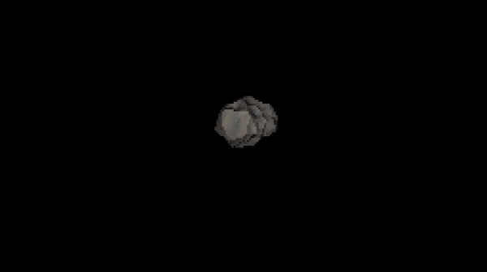

My Computer Science 30 final project: an attempt at a terminal-based 3D game from scratch in C++. This includes both the software rasterization and the game engine itself.

## ✨ Current State

- Renders and transforms meshes loaded from OBJ files
- Colors based on vertex colors and barycentric weights
    - This can result in relatively good looking objects, such as the colored asteroid shown
- Has basic shading, z-buffering, etc.
- GameEngine handles GameObjects with Scripts (structure subject to change)
- Can move the camera around in the world from input



## 🎯 Goals
- Learn some basic linear algebra
- Have the engine be reasonably fast and correct
- Understand all of the code that I'm writing
    - I now realize that this was quite ambitious
- Avoid requiring non-standard libraries

## ⚙️ How to run
- **Linux Only!**
- Modify your keyboard settings: increase repeat rate and decrease repeat delay as much as possible
    - This is the only way to semi-accurately handle real-time input in the terminal
- Decrease your terminal text size to fit the engine's resolution
- In the project directory, run:
```bash
make
./main
```
