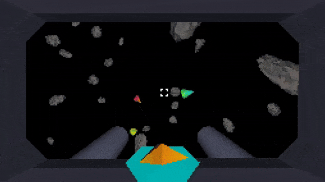

# Terminal Velocity

The year is 2525. You're yet another expendable contractor, assigned to one of the deadliest jobs in the galaxy: crystal extraction from unstable asteroid belts deep in space. Armed with only your teleportation blasters, you'll have to harvest as many alien crystals as possible before the asteroids accelerate faster than you can react. One collision, and it's over...

---

This game was originally my Computer Science 30 final project, and I later submitted it to [Summer of Making](https://summer.hackclub.com/projects/521). The code is made entirely from scratch in C++, including the software rasterizer, the game engine, and the game itself. It runs in the terminal with just about zero extra dependencies on most Linux systems.



## 🟢 Current State
- Renders and transforms meshes loaded from OBJ files
- Colors everything based on rules using barycentric weights
    - Made surprisingly decent-looking objects
- Camera has basic shading, z-buffering, etc.
- Camera, hitbox, and HUD move around the world from input
- HUD arrow guides you by pointing forwards
- Circle colliders are colliding
    - Player-asteroid and bullet-asteroid/crystal collisions
- PPM image rendering capability
- Terrible numeric font rendering

## 🎯 Goals
- Learn some basic linear algebra
- Have the engine be reasonably fast and correct
- Understand all of the code that I'm writing
    - I now realize that this was quite ambitious
- Avoid requiring non-standard libraries

## ⚙️ How to run
- **Linux Only!**
- Modify your keyboard settings: increase repeat rate and decrease repeat delay as much as possible
    - This is the only way to semi-accurately handle real-time input in the terminal
- Decrease your terminal text size to fit the engine's resolution
- In the project directory, run:
```bash
make
./main
```

## 💬 Comments
- Consider using a particularly fast terminal like kitty
- This game is surprisingly computationally expensive to run
    - I attribute it to the high number of relatively high-poly asteroids
    - Isn't a major failure of the engine itself in my opinion
